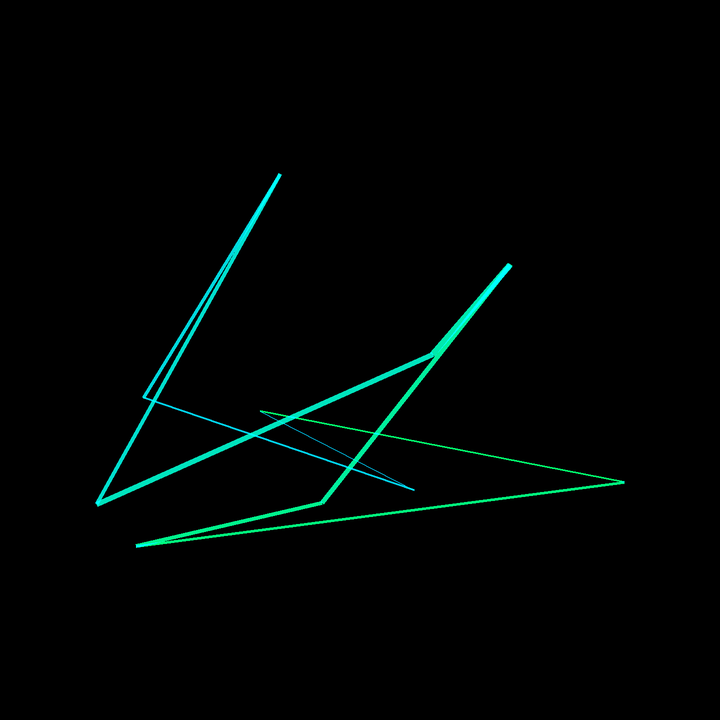
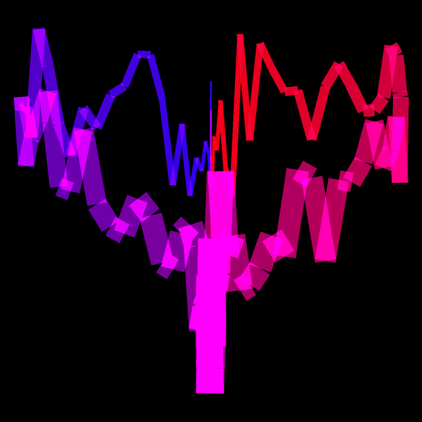

# line_art

Based on the work from [pixegami/python-generative-art-tutorial](https://github.com/pixegami/python-generative-art-tutorial).

## Point Generators

Something new I added is the ability to change the point generation process. The original script only had random points. I've added an interface that can be implemented to generate points with different algorithms or equations. For example, I've added the love point generator, which uses a parametric equation to generate a heart shape, but distorts it randomly:

